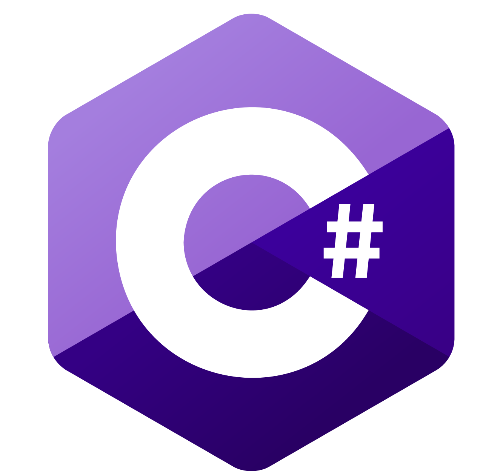

<!-- README_PROFILE -->

<!-- BANNER -->

    <!-- IMAGES INFO -->
    <!-- FIRST IMAGE ( DARK THEME ) -->
    <!--
        Author: AltumCode
        Source: ( https://unsplash.com/photos/SQi9eOsanU8 )
        Author profile: ( https://unsplash.com/@altumcode )
        License: Unsplash License ( https://unsplash.com/license )
    -->
    <!-- SECOND IMAGE ( LIGHT THEME ) -->
    <!--
        Author: AltumCode
        Source: ( https://unsplash.com/photos/a-laptop-computer-sitting-on-top-of-a-white-desk-L-RG6jBgeic )
        Author profile: ( https://unsplash.com/@altumcode )
        License: Unsplash License ( https://unsplash.com/license )
    -->
    <picture>
        <source media="(prefers-color-scheme: dark)"  srcset="image/dark-theme/profile_readme_banner.webp" />
        <source media="(prefers-color-scheme: light)" srcset="image/light-theme/profile_readme_banner.webp" />
        
    </picture>

<!-- INTRODUCTION -->

    <h1> Hi! I'm Isu! </h1>
    

        As a <strong>software engineer</strong> and <strong>student</strong>, I'm passionate about coding and devising creative solutions to real-world problems. 
        My experience mainly includes software engineering, mobile application and web application development.
        My journey in programming is marked by constant learning, experimentation, and the honing of skills through practice. 
        I'm eager to become part of a community that goes beyond mere coding, one that inspires, provides support, and shares knowledge. 💻✨
    

<!-- CONTACT & LINKS -->
 

<!-- LANGUAGES AND THEIR STATISTICS -->

    <h2> Languages & frameworks </h2>
    

        <table>
            <td>
                <picture>
                    <source media="(prefers-color-scheme: dark)"  srcset="image/dark-theme/frameworks/spring.svg" />
                    <source media="(prefers-color-scheme: light)" srcset="image/light-theme/frameworks/spring.svg" />
                    
                </picture>
                <picture>
                    <source media="(prefers-color-scheme: dark)"  srcset="image/dark-theme/frameworks/hibernate.svg" />
                    <source media="(prefers-color-scheme: light)" srcset="image/light-theme/frameworks/hibernate.svg" />
                    
                </picture>
                <picture>
                    <source media="(prefers-color-scheme: dark)"  srcset="image/dark-theme/frameworks/qt.svg" />
                    <source media="(prefers-color-scheme: light)" srcset="image/light-theme/frameworks/qt.svg" />
                    
                </picture>
                <picture>
                    <source media="(prefers-color-scheme: dark)"  srcset="image/dark-theme/frameworks/boost.svg" />
                    <source media="(prefers-color-scheme: light)" srcset="image/light-theme/frameworks/boost.svg" />
                    
                </picture>
                <picture>
                    <source media="(prefers-color-scheme: dark)"  srcset="image/dark-theme/frameworks/dotnet.svg" />
                    <source media="(prefers-color-scheme: light)" srcset="image/light-theme/frameworks/dotnet.svg" />
                    
                </picture>
                <picture>
                    <source media="(prefers-color-scheme: dark)"  srcset="image/dark-theme/frameworks/ml-dotnet.svg" />
                    <source media="(prefers-color-scheme: light)" srcset="image/light-theme/frameworks/ml-dotnet.svg" />
                    
                </picture>
                <picture>
                    <source media="(prefers-color-scheme: dark)"  srcset="image/dark-theme/frameworks/maui.svg" />
                    <source media="(prefers-color-scheme: light)" srcset="image/light-theme/frameworks/maui.svg" />
                    
                </picture>
                <picture>
                    <source media="(prefers-color-scheme: dark)"  srcset="image/dark-theme/frameworks/xamarin.svg" />
                    <source media="(prefers-color-scheme: light)" srcset="image/light-theme/frameworks/xamarin.svg" />
                    
                </picture>
                <picture>
                    <source media="(prefers-color-scheme: dark)"  srcset="image/dark-theme/frameworks/flask.svg" />
                    <source media="(prefers-color-scheme: light)" srcset="image/light-theme/frameworks/flask.svg" />
                    
                </picture>
            </td>
        </table>
    

    <picture>
        <source media="(prefers-color-scheme: dark)" srcset="https://github-readme-stats.vercel.app/api/top-langs/?username=Krystian-Isu&layout=donut&theme=transparent&hide_border=true&card_width=310&text_color=ECECEC&title_color=F4F4F4&disable_animations=true" />
        <source media="(prefers-color-scheme: light)" srcset="https://github-readme-stats.vercel.app/api/top-langs/?username=Krystian-Isu&layout=donut&theme=transparent&hide_border=true&card_width=310&text_color=191919&title_color=191919&disable_animations=true" />
        
    </picture>
     
    

        

          Coding becomes much more enjoyable when you use   ‎‎languages you really like. 
          ‎‎The languages listed below are   some of my favorites that I feel most comfortable   ‎‎learning and working with on a daily basis.
        

    

     
    

        
        
        
        
        
    

